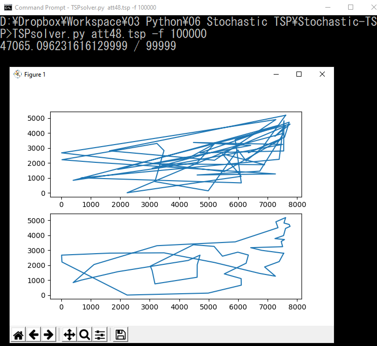

***This project was done for an assignment I had for SBSE course. The code and the documentation is from the submission.***

1.	Main algorithm  
For this project, I used steepest hill climbing (actually descent in this problem) and extended the algorithm with simulated annealing.  
For steepest hill implementation, the total distance of initial random solution is evaluated first. Then the neighboring solutions are randomly generated and evaluated to be compared with the previous solution’s fitness. If the new fitness is better than the previous one, we keep the solution and move on forward. This is a simple way to ensure each step is either stalling or improving. However, this algorithm is prone to get trapped in local optimum.  
So the simulated annealing is also implemented. This algorithm is very similar to the last one, but it has some potential to escape the local optima and hopefully produce better result. To make this happen, we have to change the steepest hill code only at the part where we decide to go on with the new neighboring solution. This time, the algorithm has possibility to move on to a solution that decreases the fitness. Although this might seem wasteful, as we decrease the possibility of this reverse action through the search, it may get us to a better optimum.  

2.	Methods (python)  
- `get_options()`: This method is a helper method to deliver the command line arguments to the inner codes. Available options are `inputfile`, `population`, `fit_eval_limit`, `verbose`, and `save`.  
`inputfile` specifies the .tsp file to load, `population` and `fit_eval_limit` provides a hyperparameter adjusting interface. The `population` is not used in my implementation. `verbose` and `save` are toggle option to toggle displaying of detailed information and saving the resulting .csv file or not.  
The return inputfile is string, p and f are integers, and verbose and save are booleans.
- `read_tsp()`: This method reads the .tsp file and returns them as `pandas` dataframe. This enables easy numpy calculation for faster fitness (distance) evaluation. The return lines has two columns labeled as “`X`” and “`Y`”.
- `read_sequence()`: Is added in case we want to reload the sequence in order to reuse the solution. This will return `numpy` array of sequence.
- `measure_distance()`: This is the fitness function and the method I want to put the most stress on. I originally tried to evaluate this by traversing through the coordinate table according to the sequence, but going through for loop and indexing the array/list was taking too much time. So I came up with a way to evaluate total distance with builtin `numpy` methods.
Originally, the code will traverse the sequence and refer to the coordinate table, calculate distance with the previous coordinate, and accumulated to the result value.  
I made a huge leap of time-wise improvement by utilizing `numpy.reindex()` and `numpy.diff()`. These methods let me rearrange the coordinates in a desired sequence and acquire the difference between neighboring points easily.  
- `dist()`: This is a helper method to help me check the validity of the last method.
- `two_opt()`: If the `measure_distance()` method was the muscle of the implementation, this method is the backbone of this implementation. This method just swaps two nodes’s position in a sequence. I added a little safety checking condition to make the program safer.
- `random_steepest()`: This implements the algorithm explained in last section. A few verbose-branched `print()` decorates the code in order to get more intuition of how the code runs. You may try the feature with `–v` option. This option is quite useful since I can see how much iteration is left for the stochastic search to stop.
- `simulated_annealing()`: This method takes in the most input parameters since it includes `initial_temperature` and `cool_rate` for annealing process. Logarithmic cooling is implemented. The `initial_temperature` and `cool_rate` have been tested for optimality, but it wasn’t easy to find a significant pattern of how the performance was affected. If I spent more time, I would have built a visualiztion tools (plotting `initial_temperature`-`distance`, `cool_rate`-`distance`, `cool_rate`-temperature degradation… etc.) for better understanding and better optimization.  
- `annealed_possibility()`: This method is a helper method to probabilistically determine whether the program should take the new solution or not. The program will always take the new solution if the solution has better fitness, but it can also take a new solution when it is worse than the current one.  
- `plot_single_path()`: This method is a helper method to visualize the improvement of the TSP solver. It is not so apparent with the rl11849.tsp file, but it can help with some intuition of what is happening with a smaller set of data such as att48.tsp (48 capitals of the U.S.A.).  
In the main code, there are a lot of block that is commented out. This is because I tried out two algorithms and wanted to leave my progress in the code for better show of my process.  
 
3. Reasons of Decisions  
There are a few things I had to decide while making this implementation, somethings that I thought of better ways but had to give up, or things that doesn’t seem necessary but decided to put in my code. These were also covered in the previous sections. Those are as the followings:  
- Using `pandas` and `numpy` methods: This is a rather obvious choice considering the structure of python list and numpy. But for a brief moment, I wanted to finish this task with the least amount of dependencies. At the end of the day, numpy has proven to be an essential for big data processing   
- Not mixing any deterministic algorithm: Although some claim professor mentioned mixing some deterministic algorithm is okay, I think this is not fair to the rule “limited fitness evaluation” since this will be a work around. This is why I abandoned using `initial_sequence_generation()` which creates a greedy algorithm based solution. Plus, I couldn’t pass sanity check with such strong initial case.
- Making saving as option + waiting for save file name to be specified: I changed this setting for submission purpose, but making these things as options has let me try out multiple instance of this program and not worry about each programs overwriting on them making it hard to retrieve the best result.
- Using steepest hill and simulated annealing: These two algorithms are fairly simple to recreate. Being new to this field, I wasn’t confident about more complex algorithm and this was still a bit challenging for me to get it run in a reasonable amount of time.
- Using helper methods for better intuition of the behavior: Plotting the paths and getting feedback of progression took a lot of time going around, but in the end it payed off since that’s the only way I knew this was taking way too much time and further monitor the program running.
- Trying two methodology: Taking these elementary steps helped me get the feel of the SBSE field and intrigued me. Looking at the leaderboard, this might not be a significant, it provided me a decent amount of practice.  

4. Results  
First figure shows a result without annealing, follwed by a result with annealing and with faster cooled annealing.

5. Possible Improvements  
Some possible improvements is getting better understanding of the effect of the cooling temperature. How fast does it cool off, and how much probability does it create/diminish was the questions I had in mind but didn’t have enough time to test it out myself. Building a testing environment for these might be beneficial for the performance.  
Another possible improvement is implementing a genetic algorithm. I am putting in a lot of computing time (with limited equipment), but people are getting much better score on the leaderboard. So I assume there is an obvious better algorithm as a solution and I suppose a genetic algorithm might help.  
Also, studying more about the [known optimal solution](https://www.math.uwaterloo.ca/tsp/rl11849/rl11849.html) will definitely help me improve the performance.  
